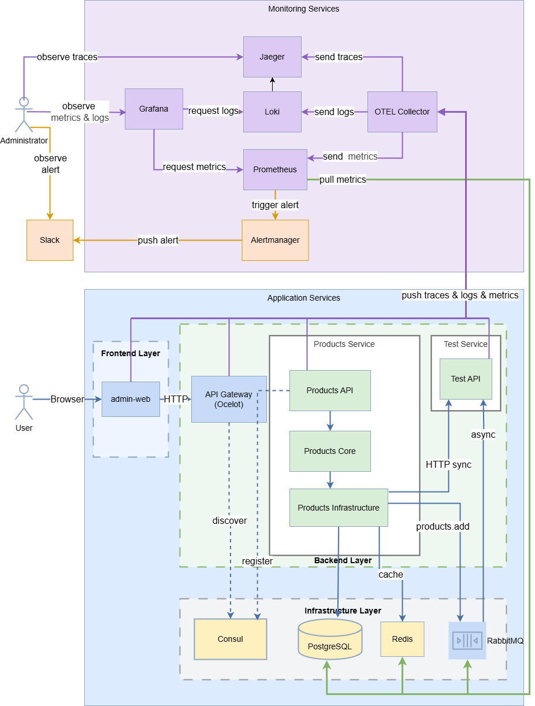
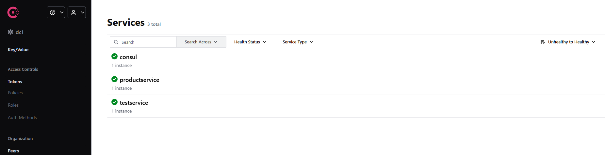
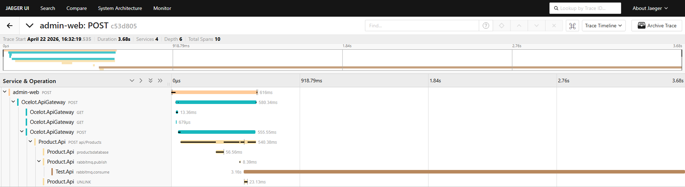
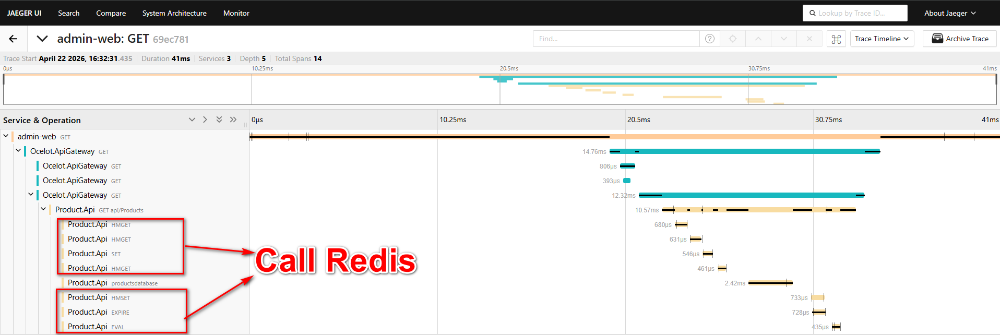
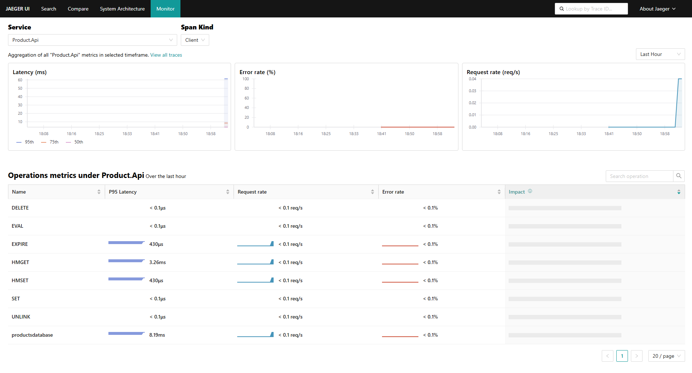
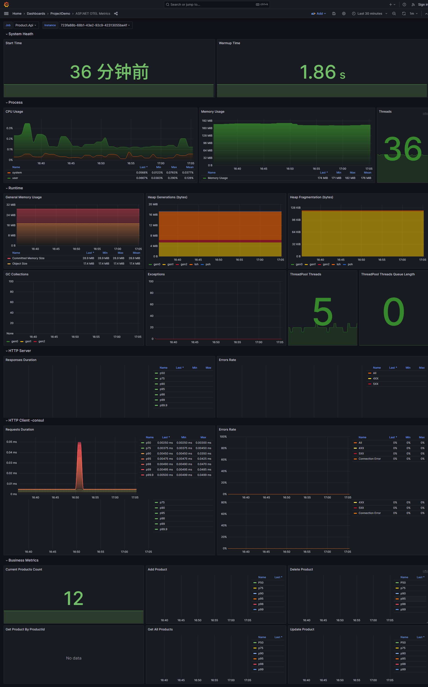
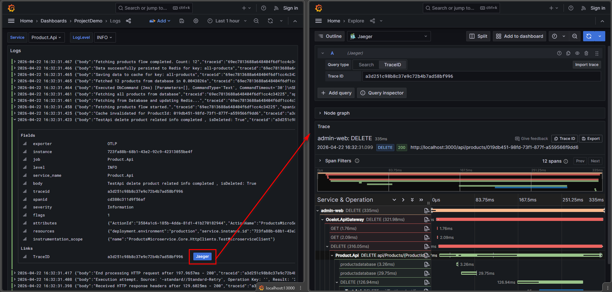
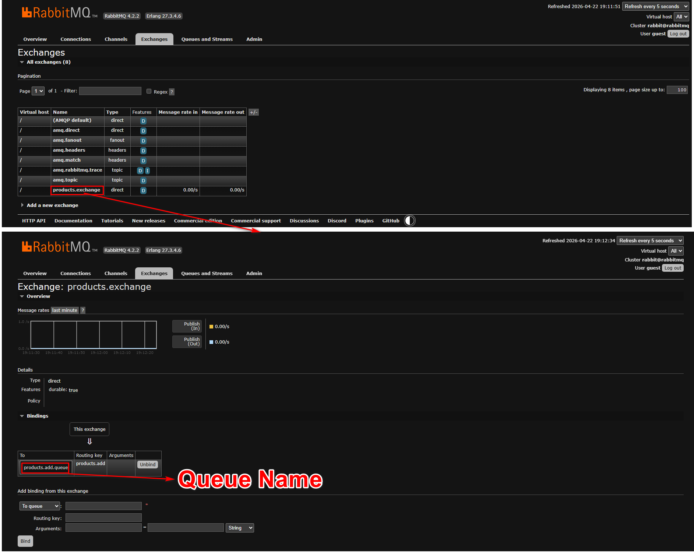
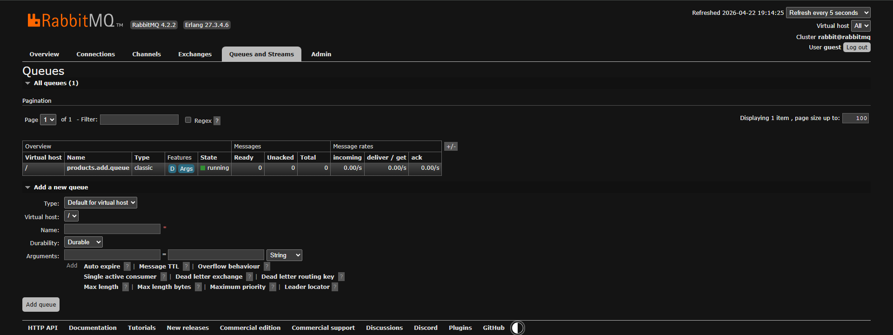
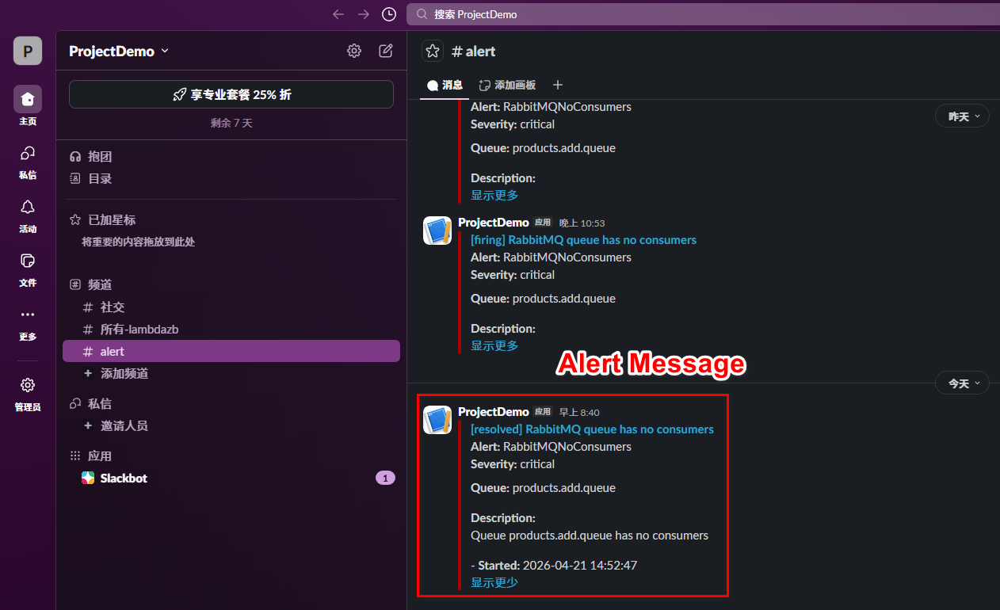

# MicroservicesDemo

**MicroservicesDemo** is a .NET 9 microservices showcase project that demonstrates API gateway routing, service discovery, event-driven messaging, distributed caching, observability, and clean architecture practices in a containerized local environment.

**MicroservicesDemo** 是一个基于 .NET 9 的微服务演示项目，展示 API Gateway 路由、服务发现、事件驱动消息、分布式缓存、可观测性与 Clean Architecture 的整合落地，运行在容器化本地环境中。

## Language Switch / 语言切换

- [中文](#中文版本)
- [English](#english-version)
- [Screenshots / 项目截图](#screenshots--项目截图)

---

## 中文版本

<details open>
<summary><strong>点击展开 / 收起中文内容</strong></summary>

### 项目亮点

| # | 亮点 | 说明 |
| --- | --- | --- |
| 1 | **AI 工具链辅助开发** | 在 `.github/` 下维护 agents、skills 与 `mcp-config.json`：例如通过 `dockerhub` MCP Server 配合 agent，辅助完成镜像 build 和 push 的自动化流程；同时沉淀 C# 测试生成与前端 UI 规范等复用能力 |
| 2 | **Ocelot API Gateway + Consul 服务发现** | 统一接入层负责路由转发；Consul 实现动态服务注册，网关按服务名发现实例，客户端与内部服务解耦 |
| 3 | **RabbitMQ 事件驱动通信** | 产品新增事件通过 RabbitMQ 异步发布，Test Service 作为消费者处理；服务间通信不再强耦合 |
| 4 | **Redis 缓存 + Decorator 模式** | 基于 Scrutor 的装饰器链把缓存层、遥测层与核心业务层分开，读取场景显著减少数据库直连压力 |
| 5 | **PostgreSQL + EF Core 数据持久化** | 通过 Options 模式管理连接配置，支持指数退避重试，可维护性强 |
| 6 | **OpenTelemetry 全链路追踪** | 前端到网关再到后端与基础设施的完整链路，Trace、Metrics、Logs 统一通过 OTEL Collector 分发 |
| 7 | **Clean Architecture + SOLID + 单元测试** | Products 服务三层分层，依赖方向严格内向；xUnit + Moq 覆盖核心服务用例 |

### 架构图

<p align="center">
  
</p>

**请求路径**：Browser → Admin Web → API Gateway (Ocelot) → Products API / Test API → PostgreSQL / Redis / RabbitMQ

**可观测路径**：所有服务 → OTEL Collector → Jaeger (Trace) / Prometheus (Metrics) / Loki (Logs) → Grafana

### 技术栈

| 分类 | 技术 | 选型原因 |
| --- | --- | --- |
| Backend | .NET 9, ASP.NET Core, EF Core | 成熟生态，支持 OpenTelemetry 原生集成 |
| Gateway | Ocelot | 轻量级 .NET API Gateway，负责集中路由，让客户端与内部服务解耦 |
| Service Discovery | Consul (Steeltoe) | 动态服务注册，支撑网关按服务名发现实例，无需硬编码下游地址 |
| Architecture | Clean Architecture, SOLID, Decorator, DI | 依赖边界清晰，Scrutor 支持无侵入装饰器链 |
| Database | PostgreSQL + EF Core | 关系型持久化，Npgsql 原生支持 OTEL |
| Cache | Redis | 减少重复读压力；通过 Decorator 模式透明叠加在业务层之外 |
| Messaging | RabbitMQ | 异步事件传播，解耦服务间依赖，生产者与消费者独立演进 |
| Observability | OpenTelemetry, OTEL Collector, Prometheus, Grafana, Jaeger, Loki, Alertmanager | 三支柱可观测性，从浏览器到基础设施完整覆盖 |
| Frontend | Next.js, React, TypeScript, TanStack Query | 接入 OTEL，前端链路也可追踪 |
| Testing | xUnit, Moq, FluentAssertions, AutoFixture | 轻量可读，符合 .NET 社区主流实践 |
| Delivery | Docker Compose | 一键启动全栈环境，可重复复现 |

### 核心功能

**产品管理（Products Service）**

- 产品的增删改查（CRUD），通过 Ocelot Gateway 对外暴露
- 新增产品后通过 RabbitMQ 发布事件，Test Service 异步消费
- 读取链路经过 Redis 缓存，减少直接数据库访问；更新与删除时同步处理缓存失效

**服务治理（Gateway + Consul）**

- API Gateway 统一对外，客户端无需感知内部服务地址
- 服务自注册到 Consul，网关按服务名动态发现并路由

**可观测性（Observability Stack）**

- 所有服务接入 OpenTelemetry，Trace、Metrics、Logs 三路并行
- Grafana 统一展示指标与日志，可从日志 TraceID 直接跳转至 Jaeger Trace
- Alertmanager 触发告警并推送至 Slack

### 项目结构

```
.github/
  agents/                        # 自定义 agent，例如 C# Expert、Expert React Frontend Engineer
  skills/                        # 自定义 skill，例如 csharp-test-gen、premium-frontend-ui
  mcp-config.json                # MCP Server 配置，例如 filesystem、context7、dockerhub
src/backend/
  Gateway/ApiGateway/          # Ocelot API Gateway，路由规则见 ocelot.json
  Services/Products/           # Products 微服务
    ProductsMicroservice.Core/           # 业务逻辑、接口契约、AutoMapper、Polly 策略
    ProductsMicroservice.Infrastructure/ # EF Core、Redis 缓存、RabbitMQ 发布、Scrutor 装饰器
    ProductsMicroService.API/            # 控制器、中间件、Consul 注册、OTEL 配置
  Services/Test/               # Test 微服务，演示 RabbitMQ 消费
  BuildingBlocks/CommonService/ # 跨服务共用组件：RabbitMQ 基类、TraceContext 中间件
src/frontend/admin-web/        # Next.js 管理台，接入 OTEL
configs/                       # 监控、告警、日志、数据库配置
docker/                        # debug（本地开发）和 deploy（演示部署）两套 Compose
tests/ProductsServiceUnitTests/ # Products 服务单元测试
```

### 快速启动

**环境要求**：Docker Desktop

**本地调试环境**（含 volume 挂载与热重载支持）：

```bash
docker compose -f docker/debug/docker-compose.yml -f docker/debug/docker-compose.override.yml up
```

**演示部署环境**（拉取预构建镜像，适合快速演示）：

```bash
docker compose -f docker/deploy/docker-compose.yml up -d
```

**常用访问地址**：

| 服务 | 地址 |
| --- | --- |
| Admin Web | http://localhost:3000 |
| API Gateway | http://localhost:9080 |
| Jaeger UI | http://localhost:16686 |
| Grafana | http://localhost:13000 |
| Prometheus | http://localhost:9090 |
| Alertmanager | http://localhost:9093 |
| Consul UI | http://localhost:8500 |
| RabbitMQ Management(账户：guest 密码：guest) | http://localhost:15672 |

**推荐演示顺序**：

1. 在Postman中导入 [MicroservicesDemo.postman_collection.json](MicroservicesDemo.postman_collection.json)
2. 通过 Admin Web 或 Postman 调用产品接口
3. 在 Jaeger 中查看请求链路（可观察 Redis、RabbitMQ 的 Span）
4. 在 Grafana 中查看指标与日志，通过 TraceID 从日志跳转至 Trace
5. 在 Consul 中确认服务注册，在 RabbitMQ 中查看队列状态

### 常见问题

1. **Docker Desktop 未启动**
  - 症状：执行 `docker compose up` 或 `docker ps` 时提示无法连接 Docker daemon，或容器始终无法创建。
  - 解决方案：先启动 Docker Desktop，确认 Docker Engine 已正常运行后，再重新执行 compose 命令。

2. **端口占用导致 Container 启动失败**
  - 症状：启动时出现 `port is already allocated`、`bind for 0.0.0.0:xxxx failed` 等错误。
  - 解决方案：修改 `docker-compose.yml` 中对应服务的端口映射配置，避开本机已被占用的端口后重新启动。

3. **依赖服务 unstarted 或 unhealthy 导致 Container 启动失败**
  - 症状：业务容器启动后立即退出，或因为 PostgreSQL、Redis、RabbitMQ、Consul 等依赖未就绪而反复重启。
  - 解决方案：在 `docker-compose.yml` 中为业务服务添加启动依赖与健康检查，并适当增加健康检查的重试次数、延长超时时间与启动宽限期，确保依赖服务真正 ready 后再启动上层服务。

4. **`alertmanager.yml` 中未填入正确的 Slack WebHook URL**
  - 症状：告警规则已触发，但 Slack 中收不到任何通知。
  - 解决方案：检查 `configs/alertmanager.yml` 中 Slack receiver 配置，确认 WebHook URL 已正确填写且仍然有效，然后重启 Alertmanager。

5. **Grafana Dashboard 中的 metric name 与实际 metric name 不一致**
  - 症状：Dashboard 面板显示 `No data`，但应用和采集链路本身运行正常。
  - 解决方案：通常是 OpenTelemetry 相关 package 更新后指标名称发生变化。需要对照 Prometheus 中当前实际采集到的 metric name，更新 Grafana dashboard 查询语句。

### 测试与验证

```bash
dotnet test tests/ProductsServiceUnitTests/ProductsServiceUnitTests.csproj
```

测试覆盖产品新增、查询、更新、删除四个核心服务，使用 Moq 注入依赖，FluentAssertions 断言，AutoFixture 生成测试数据。

### 我在这个项目中体现的工程能力

- **微服务拆分与分层设计**：独立设计 Admin Web、API Gateway、Products Service、Test Service 的职责边界，Products 服务严格遵循 Clean Architecture，依赖方向只内向不外向
- **同步与异步通信**：同步链路通过 Ocelot + Consul 路由；异步链路通过 RabbitMQ 事件发布/消费，服务间不直接耦合
- **缓存策略设计**：基于 Scrutor 的 Decorator 链将 Redis 缓存透明叠加在业务服务之外，更新与删除场景下同步处理缓存失效
- **可观测性方案搭建**：前后端均接入 OpenTelemetry，OTEL Collector 将 Trace、Metrics、Logs 分发至不同存储；Grafana 提供统一视图，Alertmanager 推送告警
- **配置管理与服务治理**：通过 Options 模式管理组件配置，Consul 提供动态服务发现，支撑无硬编码地址的服务调用
- **单元测试与可维护性**：为核心服务编写 xUnit 测试，依赖注入 Mock，断言使用 FluentAssertions，保证逻辑可回归

### 后续可扩展方向

- 接入 JWT / OAuth2 认证授权，完善 API 安全层
- 增加消息重试与死信队列，提升异步链路的容错性
- 引入 Saga 模式处理跨服务分布式一致性问题
- 多实例部署配合 Consul 负载均衡，验证横向扩展能力
- 接入 Vault 或 Kubernetes Secret 管理生产级配置

</details>

---

## English Version

<details>
<summary><strong>Click to expand / collapse English content</strong></summary>

### Key Highlights

| # | Highlight | Why it matters |
| --- | --- | --- |
| 1 | **AI-Assisted Engineering Workflow** | The `.github/` folder contains custom agents, skills, and `mcp-config.json`; for example, the `dockerhub` MCP server can be combined with agents to support automated image build and push workflows, while reusable skills capture C# test generation and frontend UI best practices |
| 2 | **Ocelot API Gateway + Consul Service Discovery** | Centralized routing layer; Consul enables dynamic service registration so the gateway resolves instances by name, decoupling clients from internal service addresses |
| 3 | **RabbitMQ Event-Driven Communication** | Product creation events are published asynchronously; the Test Service consumes them independently, keeping services loosely coupled |
| 4 | **Redis Caching with Decorator Pattern** | Scrutor-based decorator chain adds caching and telemetry transparently on top of core business logic, significantly reducing direct database reads |
| 5 | **PostgreSQL + EF Core Persistence** | Connection configuration managed via Options pattern with exponential backoff retry for resilience |
| 6 | **OpenTelemetry End-to-End Tracing** | Frontend to backend to infrastructure — traces, metrics, and logs unified through OTEL Collector |
| 7 | **Clean Architecture + SOLID + Unit Tests** | Products service enforces strict inward dependency flow; xUnit + Moq covers all core service behaviors |

### Architecture

<p align="center">
  
</p>

**Request path**: Browser → Admin Web → API Gateway (Ocelot) → Products API / Test API → PostgreSQL / Redis / RabbitMQ

**Observability path**: All services → OTEL Collector → Jaeger (Traces) / Prometheus (Metrics) / Loki (Logs) → Grafana

### Tech Stack

| Category | Technology | Why chosen |
| --- | --- | --- |
| Backend | .NET 9, ASP.NET Core, EF Core | Mature ecosystem with native OpenTelemetry integration |
| Gateway | Ocelot | Lightweight .NET API Gateway; centralizes routing and decouples clients from internal service addresses |
| Service Discovery | Consul (Steeltoe) | Dynamic registration and discovery; gateway resolves instances by service name at runtime |
| Architecture | Clean Architecture, SOLID, Decorator, DI | Clear dependency boundaries; Scrutor enables non-invasive decorator chains |
| Database | PostgreSQL + EF Core | Relational persistence; Npgsql has first-class OTEL support |
| Cache | Redis | Reduces repeated read pressure; transparently injected via Decorator pattern above the business layer |
| Messaging | RabbitMQ | Asynchronous event propagation; decouples producers from consumers so services evolve independently |
| Observability | OpenTelemetry, OTEL Collector, Prometheus, Grafana, Jaeger, Loki, Alertmanager | Full three-pillar observability from browser to infrastructure |
| Frontend | Next.js, React, TypeScript, TanStack Query | OTEL-instrumented so frontend spans appear in the same traces |
| Testing | xUnit, Moq, FluentAssertions, AutoFixture | Idiomatic .NET test stack; readable assertions and data generation |
| Delivery | Docker Compose | One-command local stack for reproducible demos |

### Core Features

**Product Management (Products Service)**

- Full CRUD exposed through the Ocelot Gateway
- New products trigger a RabbitMQ event consumed asynchronously by the Test Service
- Read flows leverage Redis caching; cache is invalidated explicitly on updates and deletes

**Service Governance (Gateway + Consul)**

- The API Gateway is the single entry point; clients do not need to know internal service addresses
- Services self-register with Consul; the gateway discovers instances by service name at runtime

**Observability Stack**

- All services instrument with OpenTelemetry; traces, metrics, and logs flow through the OTEL Collector
- Grafana provides a unified dashboard; logs are correlated to traces via TraceID
- Alertmanager fires alerts to Slack

### Repository Structure

```
.github/
  agents/                        # Custom agents such as C# Expert and Expert React Frontend Engineer
  skills/                        # Custom skills such as csharp-test-gen and premium-frontend-ui
  mcp-config.json                # MCP server configuration, including filesystem, context7, and dockerhub
src/backend/
  Gateway/ApiGateway/           # Ocelot gateway, routing rules in ocelot.json
  Services/Products/            # Products microservice
    ProductsMicroservice.Core/           # Business logic, interfaces, AutoMapper, Polly
    ProductsMicroservice.Infrastructure/ # EF Core, Redis, RabbitMQ publisher, Scrutor decorators
    ProductsMicroService.API/            # Controllers, middleware, Consul registration, OTEL setup
  Services/Test/                # Test microservice — RabbitMQ consumer demo
  BuildingBlocks/CommonService/  # Shared: RabbitMQ base classes, TraceContext middleware
src/frontend/admin-web/         # Next.js admin UI with OTEL instrumentation
configs/                        # Monitoring, alerting, logging, database, exporter config
docker/                         # debug (dev) and deploy (demo) Compose files
tests/ProductsServiceUnitTests/ # Unit tests for Products services
```

### Quick Start

**Prerequisite**: Docker Desktop

**Local debug environment** (with volume mounts and hot reload support):

```bash
docker compose -f docker/debug/docker-compose.yml -f docker/debug/docker-compose.override.yml up
```

**Demo deployment** (pull pre-built images, fastest to start):

```bash
docker compose -f docker/deploy/docker-compose.yml up -d
```

**Key URLs**:

| Service | URL |
| --- | --- |
| Admin Web | http://localhost:3000 |
| API Gateway | http://localhost:9080 |
| Jaeger UI | http://localhost:16686 |
| Grafana | http://localhost:13000 |
| Prometheus | http://localhost:9090 |
| Alertmanager | http://localhost:9093 |
| Consul UI | http://localhost:8500 |
| RabbitMQ Management(Account/Password:guest) | http://localhost:15672 |

**Recommended demo flow**:

1. Import [MicroservicesDemo.postman_collection.json](MicroservicesDemo.postman_collection.json) to Postman
2. Trigger product operations through Admin Web or Postman
3. Inspect the distributed trace in Jaeger — observe Redis and RabbitMQ child spans
4. Open Grafana Logs, find a trace ID in a log entry, and jump directly to the Jaeger trace
5. Check Consul UI for registered services; check RabbitMQ management for queue activity

### FAQ

1. **Docker Desktop is not running**
  - Symptom: `docker compose up` or `docker ps` cannot connect to the Docker daemon, or containers never get created successfully.
  - Fix: Start Docker Desktop first, make sure Docker Engine is healthy, then rerun the compose command.

2. **Container startup fails because the required port is already in use**
  - Symptom: Errors such as `port is already allocated` or `bind for 0.0.0.0:xxxx failed` appear during startup.
  - Fix: Update the port mappings in `docker-compose.yml` so they do not conflict with ports already used on the host machine, then start the stack again.

3. **Container startup fails because dependency services are unstarted or unhealthy**
  - Symptom: Application containers exit immediately or keep restarting because PostgreSQL, Redis, RabbitMQ, Consul, or other dependencies are not ready yet.
  - Fix: Add startup dependencies and health checks in `docker-compose.yml`, and increase health-check retries plus timeout or startup grace periods where needed so upstream services only start after dependencies are actually ready.

4. **The correct Slack WebHook URL is not configured in `alertmanager.yml`**
  - Symptom: Alert rules fire, but no notifications arrive in Slack.
  - Fix: Verify the Slack receiver configuration in `configs/alertmanager.yml`, provide a valid WebHook URL, and restart Alertmanager.

5. **Metric names in Grafana dashboards do not match the actual metric names**
  - Symptom: Panels show `No data` even though the application and telemetry pipeline are running.
  - Fix: This is commonly caused by OpenTelemetry package upgrades that rename exported metrics. Compare the live metric names in Prometheus and update the Grafana dashboard queries accordingly.

### Testing and Verification

```bash
dotnet test tests/ProductsServiceUnitTests/ProductsServiceUnitTests.csproj
```

Covers the four core Products service behaviors (add, get, update, delete) using Moq for dependency injection, FluentAssertions for readable assertions, and AutoFixture for test data generation.

### Engineering Competencies Demonstrated

- **Microservice decomposition and layered design** — independently designed responsibility boundaries across Admin Web, API Gateway, Products Service, and Test Service; Products service enforces strict Clean Architecture with inward-only dependencies
- **Synchronous and asynchronous communication** — sync requests flow through Ocelot + Consul routing; async events flow through RabbitMQ publish/consume, eliminating direct service-to-service coupling
- **Caching strategy design** — Scrutor decorator chain adds Redis caching non-invasively above the business layer; cache invalidation is handled explicitly on update and delete flows
- **Observability pipeline setup** — both frontend and backend emit OpenTelemetry signals; OTEL Collector routes traces, metrics, and logs to separate backends; Grafana, Jaeger, and Alertmanager provide unified visibility
- **Configuration management and service governance** — strongly-typed Options pattern for all component configuration; Consul-based discovery removes hardcoded downstream addresses
- **Unit testing and maintainability** — xUnit tests for all core service behaviors, Moq-injected dependencies, FluentAssertions for readable verification

### Future Extensions

- Add JWT / OAuth2 authentication and authorization
- Implement dead-letter queues and retry policies for async resilience
- Introduce the Saga pattern for distributed transaction consistency
- Demonstrate horizontal scaling with multi-instance deployment and Consul load balancing
- Integrate Vault or Kubernetes Secrets for production-grade configuration management

</details>

---

## Screenshots / 项目截图

<details open>
<summary><strong>Architecture and Service Discovery / 架构与服务发现</strong></summary>

### Components Diagram


`ComponentsDiagram.png` - Overall architecture showing admin-web, API Gateway, Products Service, Test Service, PostgreSQL, Redis, RabbitMQ, Consul, and the observability stack.

### Consul Service Discovery



`Consul.png` - Service registration view showing discovered services such as consul, productservice, and testservice.

</details>

<details>
<summary><strong>Tracing, Metrics, and Logs / 链路追踪、指标与日志</strong></summary>

### Jaeger Trace - Post Flow



`JaegerTrace1.png` - Distributed trace of a GET request, including gateway traversal and Redis-related operations.

### Jaeger Trace - Get Flow



`JaegerTrace2.png` - Distributed trace of a POST request, including API processing and RabbitMQ publish / consume behavior.

### Jaeger Monitor



`JaegerMonitor.png` - Monitoring view for Product.Api operations, latency percentiles, request rate, and error rate.

### Grafana OTEL Metrics



`GrafanaOTELMetrics.png` - Grafana dashboard presenting ASP.NET OTEL metrics, runtime metrics, thread pool, and business metrics.

### Log to Jaeger Trace



`LogToJaegerTrace.png` - Example of correlating logs with a trace by jumping from log context to the associated Jaeger trace.

</details>

<details>
<summary><strong>Messaging and Alerting / 消息队列与告警</strong></summary>

### RabbitMQ Exchange



`RabbitMQ_Exchange.png` - RabbitMQ exchange configuration for the product-related message flow.

### RabbitMQ Queue



`RabbitMQ_Queue.png` - RabbitMQ queue view showing the products.add.queue runtime state.

### Slack Alert Message



`SlackAlertMessage.png` - Alert example showing how queue-related issues can be surfaced to Slack through Alertmanager.

</details>


